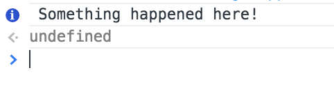
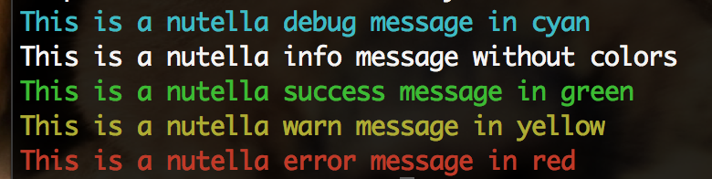

# nutella.log
The nutella log APIs are definitely nothing crazy-original.

1. `nutella.log.debug(message, [code])`
1. `nutella.log.info(message, [code])`
1. `nutella.log.success(message, [code])`
1. `nutella.log.warn(message, [code])`
1. `nutella.log.error(message, [code])`

The `code` is a numeric code similar to the one used in [HTTP](http://tools.ietf.org/html/rfc7231#section-6) that is optional in all logging APIs and should help application designers better debug their applications. The applications designers are free to specify and use whatever `code` they think is more appropriate.

In each implementation of `nutella_lib.*`, the role of these APIs is to wrap the logging facilities provided by the language and to ship a copy of each message to the `logs` channel. This is done to centralize the analysis and filtering of logs generated by all components of the application. For instance, if in a javascript application i call
```javascript
nutella.log.info('Something happened here!', 12345);
```
what will happen is that: first, my console will look something like this



and a message will be published to the `logging` run-level channel (a.k.a. `/nutella/apps/app_id/runs/run_id/logging`) that looks something like this
```json
{
    "type": "info",
    "message": "Something happened here!",
    "code": 12345
}
```

Finally, Whenever you are printing to a Command Line Interface it would be nice to follow this color scheme.

