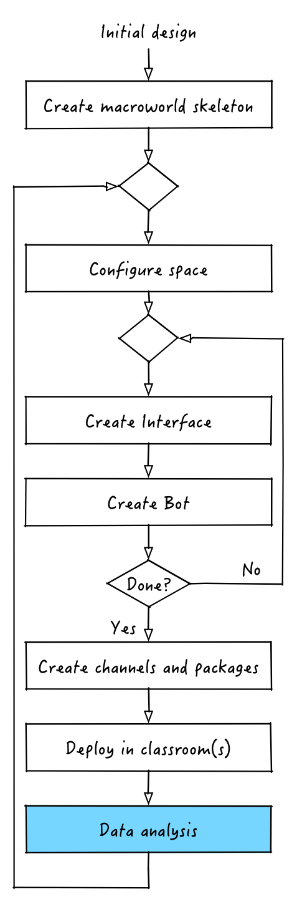

# Data analysis

## Retrieving data a posteriori
Once students and teachers used our application, there will be plenty of data for us to analyze. In order to retrieve those data we simply have to head to the MongoDB that was running on the same machine where nutella served the application. Using your favorite tool, I dig [Robomongo](http://robomongo.org/), connect to the database called `nutella` and to the collection called `dump`. That's it

Bulk APIs

## Retrieving data while things happen

## Where now?
Congratulations! You just went through the development, enactment and data analysis phases of a macroworld application! Now that you have an idea of what the whole process is like you can keep tinkering with the hunger-games and add some more interfaces and/or bots. Or you might want to digg in our in-depth guides to discover more advanced features of nutella. 

Have questions? Don't hesitate to reach out to us!

[:arrow_backward: PREV](tutorial_9.md)