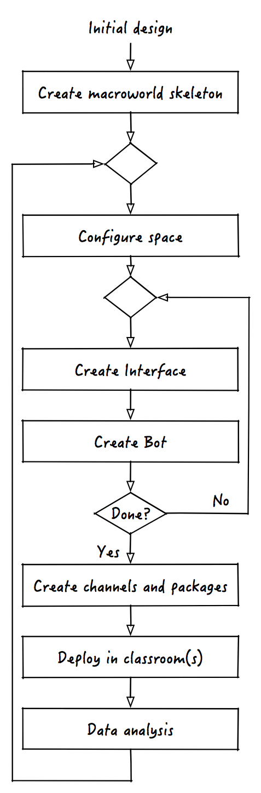

# Wait! What are we building again?

Now that we satisfied our tinkering needs, before we can embark in the journey that will take us from an empty application skeleton to a fully working macroworld we need to do two things:

1. Decide what we are building, that is what our application will do
2. Understand how macroworld applications are built 

# What is a macroworld?
Macroworlds are classroom-sized simulations of scientific phenomena. They occupy the physical space of the classroom and unfold concurrently in real-time giving students a chance to study them like real scientists will do.

# The Hunger Games
The Hunger Games is a macroworld application that simulates the foraging of a bunch of squirrels. In Hunger Games, each student in the classroom is provided with a small stuffed animal ("squirrel") that serves as his or her "avatar" during the activity. Students forage by moving their squirrels among a set of "food patches" of varying quality distributed around the classroom, gaining energy as a function of the elapsed time in the patch, patch quality, and competition within the patch (i.e., the presence of other squirrels). 

This description of the activity is a bit vague on purpose. Often, when creating new macroworlds, designers start with an "half-shaped" idea which is iteratively refined by testing the prototype created by developers.

# Building macroworlds with nutella
Under the hood, macroworlds are similar to simulations and, like simulations, they can be about a range of different topics. No matter what the topic is, macroworlds "life-cycle" can be summarized by the flowchart below.

In the rest of the tutorial we will see how to build the Hunger Games macroworld application going through each one of the steps in the flowchart. Let's start!

[:arrow_backward: PREV](tutorial_1.md) | [NEXT :arrow_forward:](tutorial_3.md)

