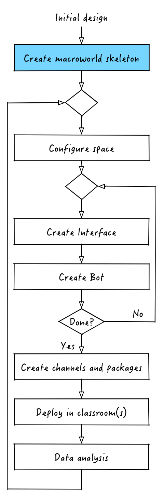

# Creating the macroworld skeleton



The first step to create our Hunger Games macroworld is to create the nutella application skeleton. Similar to what we did in our "instant gratification" all we have to do is:
```
$ nutella new hunger-games
```


We can of course start the macroworld by doing 
```
$ cd hunger-games
$ nutella start
```
which will output:
```
Application hunger-games started!
Application is running on broker: 127.0.0.1
Go to http://localhost:57880/hunger-games/default to access your interfaces
```

To stop running the Hunger Games we can of course do:
```
$ nutella stop
```

**Pro-tip: you will use `nutella start` and `nutella stop` hundreds of times while developing the Hunger Games.**

Now that we have an application skeleton ready to go we can move to the next step, configuring the physical space of the classroom. 

[:arrow_backward: PREV](tutorial_2.md) | [NEXT :arrow_forward:](tutorial_4.md)