# Configure space and resources
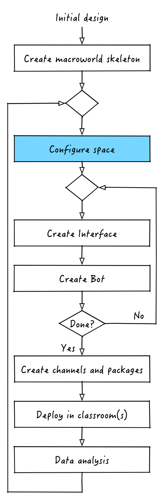

The first step in the creation of any macroworld is the configuration of the physical space of the classroom and the resources (i.e. devices) that we are going to use to manifest the simulation in the classroom. In other words we need to tell our macroworld simulation where are the devices that we are going to use in this simulation. 

Let's look at the Hunger Games. What are the resources here?
- 6 food patches, represented by iPads
- _n_ iBeacons, where n is the number of kids in the classroom

How do we tell our macroworld about them? Simply by using one of the tools that nutella provides to us: **RoomPlaces**. To open RoomPlaces simply start the hunger-games application again (`nutella start`, remember?) and click on the "Launch" button next to "RoomPlaces (Classroom layout)" in the main interface, as shown here.

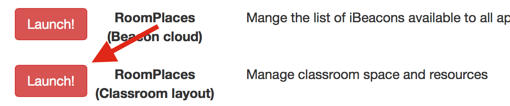

This will launch the RoomPlaces Classroom layout interface which will look something like the picture below.

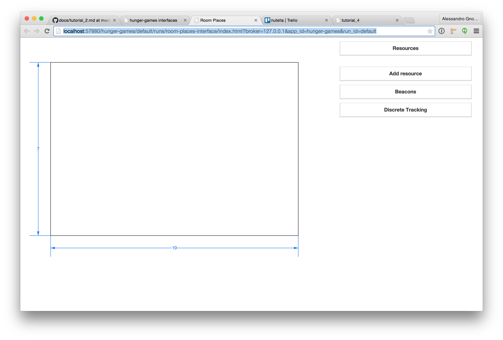

The interface is divided roughly into two separate areas. The rectangle on the left represents a stylized map of the classroom (that is now empty since there are no resources in the classroom yet). The drop-downs on the right are:
- *Resources*: lists all the resources that are part of this macroworld application (empty for now).
- *Add resource*: used to add a resource(click to expand)
- *Beacons*: lists all the beacon that are available to be used with this application (click to expand)
- *Discrete tracking*: controls the tracking system (click to expand)

In the next sections we will see how to use each one of them to add and configure resources to this application.

## Changing the room size
The first thing we want to do is to change the room size to fit the room of our classroom. How do we do that? Easy! Click on the numbers on the left and at the bottom of the map and change the values in the alert window. That's it! For our hunger games macroworld, let's keep the default values of 7 X 10.

Of course you'll need to measure the real classroom where you are going to run the macroworld in order to have proper measures. Wondering about measuring units? **Every measure in RoomPlaces is expressed in meters**.  

Now that that our virtual room reflects the size of the real classroom it is time to start adding resources. RoomPlaces distinguishes among two kinds of resources: static and dynamic. **Static resources** are the ones that don't change location during the macroworld enactment, **dynamic resources** do. 

In the Hunger Games the iPads are static resources because food patches never change their location while the iBeacons are dynamic resources because they move with the kids as they forage around the room. 

## Adding static resources
To add static resources click on the "Add resource" drop-down. You'll have then to fill into four parameters:
1. Resource ID: this is the unique identifier for this resource
2. Device type: this is the type of device
3. Tracking: this is the type of tracking (you can leave the default value here)
4. Resource type: S for static, D for dynamic

Once you are ready just click on the "+" button to add the resource. The resource will appear at the center of the map (on the left) and under the "Resources" drop-down (on the right). You can now drag the resource where it belongs and, if you want fine control over where to place it, click on the 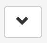 button in the resource line under the "Resources" drop-down and enter values for X and Y manually.

For our Hunger Games simulation we will have to add 6 food patches. We'll call them `patch-a, patch-b, ..., patch-f` (that's their resource ID), we'll choose iPad for device type and S (static) for resource type. As far as position goes, let's put them at:
```
- patch-a: (2, 6.6)
- patch-b: (7, 6.6)
- patch-c: (9.5, 5.35)
- patch-d: (9.5, 2.2)
- patch-e: (8.2, 0.4)
- patch-f: (5.7, 0.4)
```

**Pro-tip: as you might have astutely deducted the origin of the classroom coordinate system is in the bottom left corner of the map**

Once you are done the interface should look something like this.

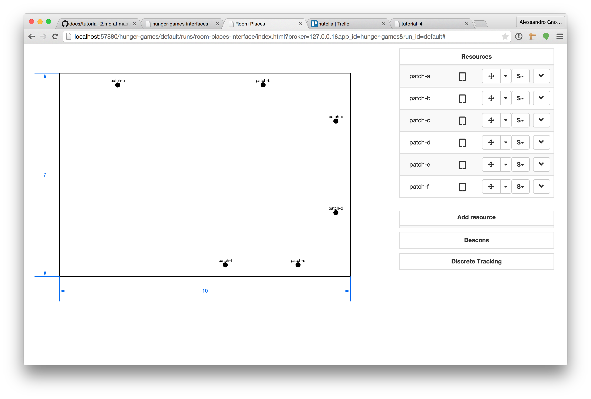

## Adding dynamic resources
Now that we are done adding the static resources it's time to add the dynamic ones. RoomPlaces distinguishes among two different kinds of dynamic resource: the ones that are capable of "sensing" their location and the ones that can't. Resources that can sense their location use iBeacon technology to detect their proximity to other (static) resources. Since they have "super-powers" iBeacon-powered resources are treated separately.

In Hunger Games we are luck and all dynamic resources are iBeacon powered so we don't need to add any dynamic resources manually but we can use the facilities that nutella provides for iBeacons technology. If you want to know more about non-beacon dynamic resources, check out our [dynamic resources page](../in-depth/roomplaces-dynamic-resources.md).

## Adding beacons
Adding beacons to our macroworld application is a thee-steps process: adding the beacon to the system using the RoomPlace Beacon Cloud interface, adding the beacons to the macroworld application using the RoomPlaces Classroom layout interface and configuring the tracking system.

### Step 1: beacon cloud
The fist thing we need to do to add beacons to our macroworld is to add the beacons to nutella (unless someone already did that for us). In order to do this we need to use a different interface provided by nutella called **RoomPlaces (BeaconCloud)**. To start it, go back to the main interface (the one with all the red buttons that say "Launch", remember?) and click on the "Launch button" next to RoomPlaces (BeaconCloud). This will launch an interface that will look something like this.
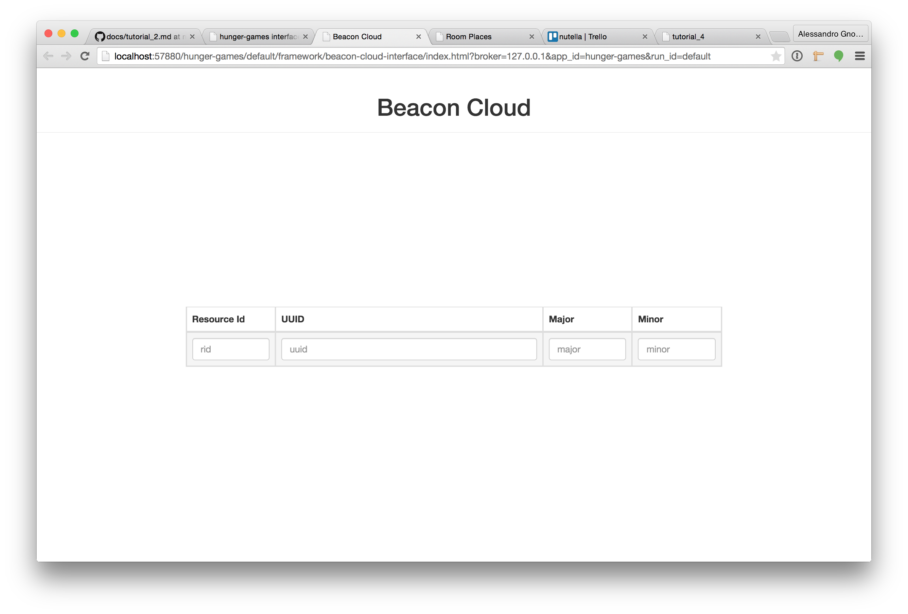

Depending on the type of iBeacon you are using, you'll need to use the vendor-provided tools to read the UUID, major and minor and enter them into the Beacon Cloud interface together with a unique identifier which will be used in the main RoomPlaces interfaces and everywhere else in the nutella framework. Beacon cloud basically acts as a repository of iBeacon devices that is vendor-independent and specific to each installation of nutella. If you want to know more about UUIC, major, minor and beacon cloud, check out our [beacon cloud page](../in-depth/roomplaces-beacon-cloud.md). 

It is also possible to use almost all Bluetooth LE readers (such as iPads) as iBeacons as well. If you are interested in knowing more about this, check out our [virtual beacons page](../in-depth/roomplaces-virtual-beacons.md).

Once you have added a bunch of beacons to your beacon cloud it should look something like this.

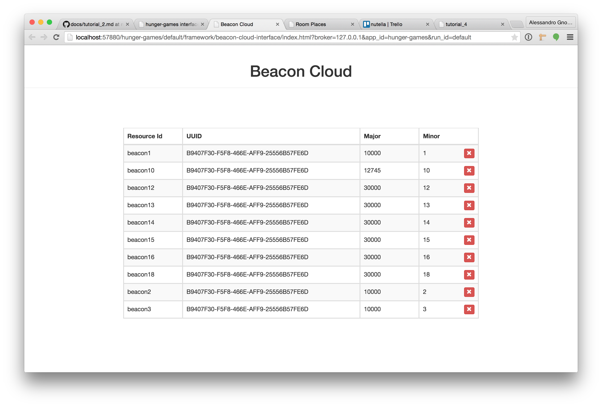

### Step 2: adding to the application
Once you are done adding beacons to the system you can go back to the classroom layout interface and reload it. If you now click on the beacons drop down you'll now see all the beacons that you added to the beacon cloud are now there. 

Using the "+" button we can now add as many as we need to our application. Suppose we have n = 10 kids in our classroom, one beacon per kid, and so we are going to add 10 beacons. As you see this is reflected in the list of resources which now features 10 beacons.

### Step 3: configuring tracking
As you might have already noticed all the beacons listed under resources have a 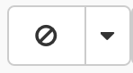 button next to them. This means that, even if we added them to the macroworld, they have not been activated yet. I order to activate them all we have to do is to click on the  button and choose "proximity" from the drop down.

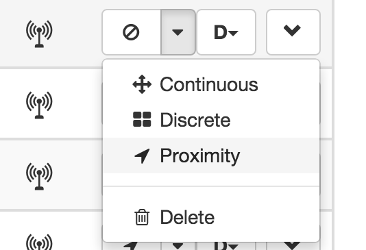

However, for beacons to work correctly, we need to define a series of "proximity areas" around static resources for beacons to be detected. In order to do this we need to click once again on the  button next to static resources and change the "proximity" value which represents the detection radius of the static resource. For the Hunger Games simulation we'll set it to 0.7 for all our patches. As you see, as soon as you do so, the map displays a blue circle around static resource, indicating that a proximity detection radius has been activated for the resource. Your interface should look something like this at this point.

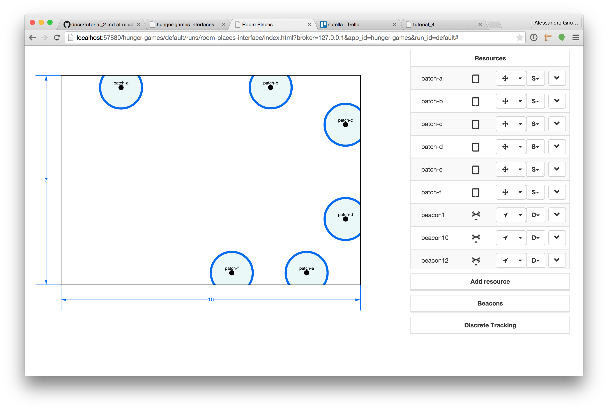


## Testing
Now that out classroom setup is complete we are ready for some testing. Luckily this doesn't mean we actually need to deploy iPads, and run around with real iBeacons but we can use the build in simulator that nutella provides. In order to do so simply head back to the nutella main interface, start Room Debugger and scroll all the way down to the bottom to the RoomPlaces simulator. 

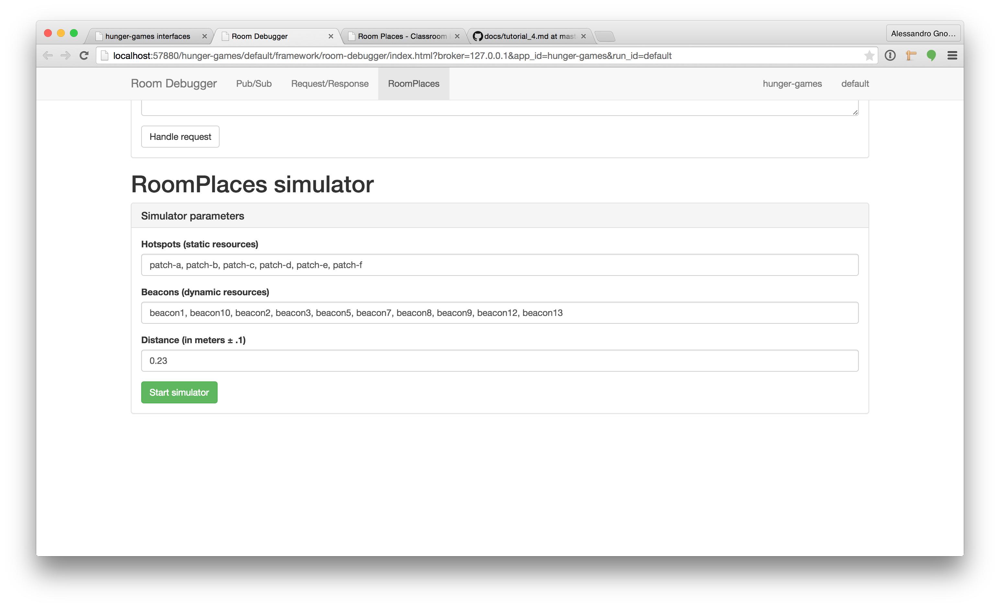

As you see, the beacons and hotsposts arrays have been already fetched and all you have to do is hit the "Start simulator" button. If you go back to your RoomPlaces classroom layout interface you should see it start blinking all over the places with circles, like the picture below.

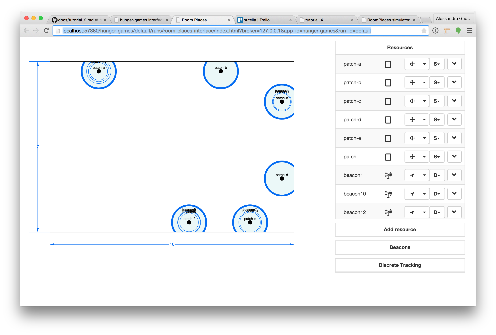

Each circle represents a beacon (i.e. a kid) and as you see they are moving from one patch to the other and their movement is being detected by roomplaces.


# Next
As you might have noticed we left quite a bit behind about RoomPlaces. If you want to keep reading about it, follow the links in this page, otherwise if you are anxious to keep building, keep reading the tutorial. Next up, creating out first interface. 


[:arrow_backward: PREV](tutorial_3.md) | [NEXT :arrow_forward:](tutorial_5.md)
