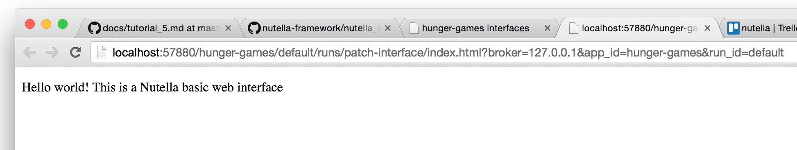
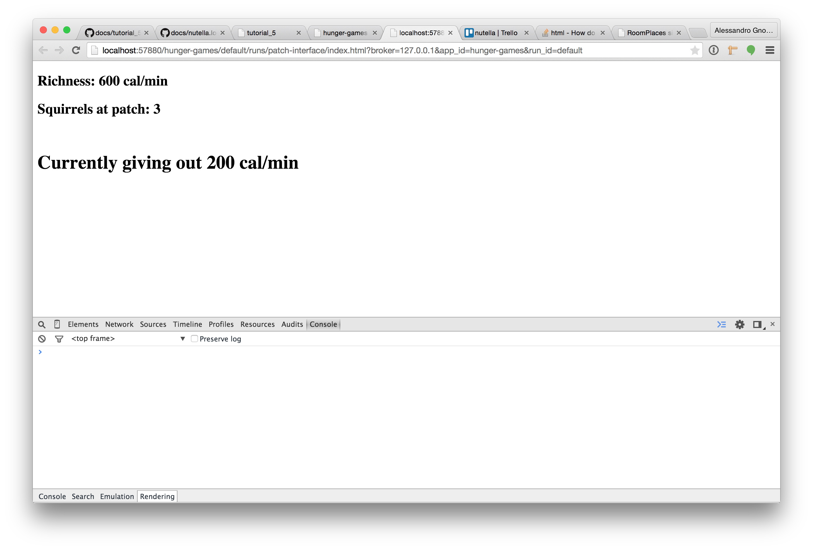

# Create interface (front-end)


One of the nicest features nutella provides its user is the ability to create a macroworld application simply creating its individual components and "forget" about all the plumbing between them. There are two different components types in nutella: bots and interfaces. Bots are "back-end" components and are used to power simulations, aggregate data, calculate things, etc. Interfaces are "front-end" components and are used by users to interact with the macroworld.

The next step in our journey to building the hunger games macroworld is to create our first component: an interface that will display the amount of calories each squirrel is getting at each patch. 

Before we can start, we need to decide which technologies to use. Since at the moment of writing nutella supports web and native iOS interfaces and, statistically, most of the readers will be familiar with JavaScript we'll pick a web interface.

## Finding and installing the right RoomComponent

The first step when building a new component in nutella is to take advantage of the RoomComponents: a library of components available for you to download and install into your application to speed up your development. You can browse the components list at [https://github.com/nutella-framework/nutella_framework/tree/templates-database](https://github.com/nutella-framework/nutella_framework/tree/templates-database).

For our `patch-interface` we are going to use `basic-web-interface` template. To install this template inside our project all we have to do is:
```
$ nutella install basic-web-interface patch-interface
Installed template: basic-web-interface as patch-interface
```

This command will install all the files of `basic-web-interface` inside the `interfaces/patch-interface` folder of our `hunger-games` project. You can then go back to the nutella main interface, refresh the page and you should see a new red button at the top of the page, next to 'patch-interface'. Guess what that button does? Yup, you got it. If you click on it you'll see this (which is exactly what nutella main interface is).



Ok, it works, now what? How do you change things? Just fire up your favorite editor (who said Sublime?) and start to tinker with `index.html`! But we are trying to create a patch interface for the hunger games remember? So how do we go about it? Read on to find out! However, if you want to find out more about RoomComponents and how to use them, read our [RoomComponents page](../in-depth/roomcomponents.md).


## Creating `patch-interface`
Patch interface needs to display how many calories each squirrel is getting at each patch. This is given by the simple formula `patch_richness/n_squirrels_at_patch`. Pretty simple right? But how do we get these two variables? nutella can help with both.

### Step 1: patch richness
Patch richness, as the name suggests, is a property of food patches that needs to be set. For the hunger games, let's say we are going to use these values
```
- patch-a: 10 cal/s
- patch-b: 10 cal/s
- patch-c: 15 cal/s
- patch-d: 15 cal/s
- patch-e: 20 cal/s
- patch-f: 20 cal/s
```
But how do we set this value? We can take advantage of a feature provided by RoomPlaces which allows you to store arbitrary key-value pairs for each resource in the systems. To do so, just open RoomPlaces classroom layout once again, click on the  for `patch-a` and simply enter `patch_richness` in the key and `10` in the value and hit enter. Done! Do the same operation for all the other patches and you are ready to go.

How do we read those values though? Go back to your text editor where you where tinkering with `patch-interface/index.html` and add the following code right where it says `// Your code that uses the nutella instance here`:
```javascript
nutella.location.ready(function(){
    console.log(nutella.location.resource['patch-a'].parameter['patch_richness']);
});
```
Reload your `patch-interface/index.html`, check out your console and look what's there! 10, exactly the value for `patch_richness` that we set. Of course you can try to do the very same thing for all other patches and you can add even more key-value pairs. It works. :bowtie: Now onto the second bit. 

### Step 2: number of squirrels at patch
How do we get a count of how many kids are at a certain patch? How about this?
```javascript
var n_squirrels_at_patch = 0;
nutella.location.resource['patch-a'].notifyEnter = true;
nutella.location.resource['patch-a'].notifyExit = true;
nutella.location.resourceEntered(function(beacon, patch) {
    if (patch.rid === 'patch-a')
        n_squirrels_at_patch++;
});
nutella.location.resourceExited(function(beacon, patch) {
    if (patch.rid === 'patch-a')
        n_squirrels_at_patch--;
});
```
What we are doing here is to basically to use nutella's location module to subscribe and capture all arrival/departure events generated by the kids when they walk in and out of the patch.

### Step 3: putting it all together
Putting things together should be as easy as
```javascript
var richness;
var n_squirrels_at_patch;
var calories_per_second;

nutella.location.ready(function(){
    richness = nutella.location.resource['patch-a'].parameter['patch_richness'];
    
    // Compute initial number of squirrel and richness at the patch (in case some kids are there already)
    var f = nutella.location.resources.filter(function(e) {
        return e.proximity!==undefined && e.proximity.rid === 'patch-a';
    });
    n_squirrels_at_patch = f.length;
    calories_per_second = n_squirrels_at_patch==0 ? richness : richness / n_squirrels_at_patch;
    // Subscribe to arrival/departure events
    nutella.location.resource['patch-a'].notifyEnter = true;
    nutella.location.resource['patch-a'].notifyExit = true;
    // Update calories_per_second on arrival/departures
    nutella.location.resourceEntered(function(beacon, patch) {
    if (patch.rid === 'patch-a') {
        n_squirrels_at_patch++;
        calories_per_second = n_squirrels_at_patch==0 ? richness : richness / n_squirrels_at_patch;
    }
    });
    nutella.location.resourceExited(function(beacon, patch) {
    if (patch.rid === 'patch-a') {
        n_squirrels_at_patch--;
        calories_per_second = n_squirrels_at_patch==0 ? richness : richness / n_squirrels_at_patch;
    }
    });
});
```

Now, all we have to do is display our result which can be easily achieved with a bit of html and Javasript.

The final result looks like the screenshot below. :shipit:



Now it's time for your designer to make things pretty because this sure is an ugly interface! :smiley:

In the meanwhile it's time for us to move to the back end and implement our first bot.

[:arrow_backward: PREV](tutorial_4.md) | [NEXT :arrow_forward:](tutorial_6.md)
