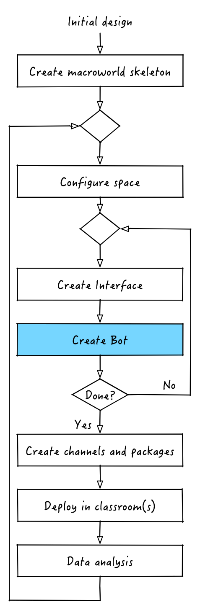

# Create bot (back-end)


Now that we have successfully created our first interface it is time to work on our first bot. As we said before, bots are used for back end components and, in our Hunger Games macroworld, we will create a bot to assemble and store the total amount of calories collected by each kid while foraging. These statics will then be used by the kids to reflect on their foraging behavior and hopefully help them better understand the rules of the game.

Similarly to what we did for our interface we are going to use JavaScript and RoomComponents. In particular, for out `stats-bot` we are going to use `basic-node-bot`. Similarly to what we did for out `patch-interface` we can install the RoomComponent into our application by doing
```
$ nutella install basic-node-bot stats-bot
Installed template: basic-node-bot as stats-bot
```

Since we are installing a bot component and not an interface component the files for our `stats-bot` will be created in `bots/stats-bot`. 


## Starting and monitoring your bot

The one difference with interfaces is that, in order to start a newly created bot, you need to restart nutella. Therefore just do
```
$ nutella stop
Application hunger-games stopped!
$ nutella start
Application hunger-games started!
Application is running on broker: 127.0.0.1
Do `tmux attach-session -t hunger-games/default` to monitor your bots.
Go to http://localhost:57880/hunger-games/default to access your interfaces
```

If you compare the `nutella start` command output with the output of the same command from earlier you'll notice an extra line appeared.
```
Do `tmux attach-session -t hunger-games/default` to monitor your bots.
```

When you type `nutella start`, the framework automatically starts all your bots and creates a [tmux](http://tmux.sourceforge.net/) session for you to monitor them. tmux is simply a terminal multiplexer similar to [screen](http://www.gnu.org/software/screen/). Each bot in your macroworld application is executed inside its own tmux window. You can swap between windows by pressing `control-c` and then the number of the window you want to go to. To get out of this "virtual shell" without killing it simply type `ctrl-c` and then `d`.

**Pro tip: you'll use tmux extensively so if you are not familiar with it we strongly suggest take a minute to check out [Daniel Miessler's tmux primer](https://danielmiessler.com/study/tmux/)**

Now that we learned how to monitor our bot let's start to tinker with it!

## Implementing `stats-bot`
In order to collect the total amount of calories accumulated by each student we will need to set the beginning and ending of the collection time (using a message sent to the bot) and then use the arrival/departure events to calculate the amount of time spent at each patch. Let's see how to do that.


**... finish nulla_lib.js ...**


[:arrow_backward: PREV](tutorial_5.md) | [NEXT :arrow_forward:](tutorial_7.md)