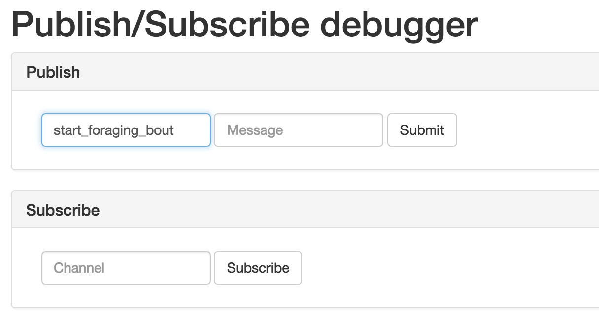

# Finishing up our application


Now that we created `patch-interface` and `stats-bot` are we done or do we need to create any other component? We actually need one more interface for the kids to visualize the data calculated by `stats-bot`. We are going to call this component `aggregate-interface`. 

To speed things up a bit, we built this component already so all you have to do is install it. However, to do so, we are going to use a variation of the `nutella install` command which allows you to install components from any git repository. To install `aggregate interface` in your `hunger-games` macroworld application simply do
```
$ nutella install https://github.com/nutella-framework/aggregate-interface.git
Installed template: https://github.com/nutella-framework/aggregate-interface.git as aggregate-interface
```
As expected, this will create the `interfaces/aggregate-interface` folder in your project and copy all the files in there. You can check it out as usual, via the main-interface. 

## Using Room Debugger
Not much to see you say? You are absolutely right! Remember? Our macroworld is powered by kids moving around so we need to simulate some movement to see what happens.

Head back to Room Debugger and send a `start_foraging_bout` message to the bot. How? Like this!




Now that all our components have been created and tested we are ready to plan our classroom deployment and bundle up our components in a way that will make it easy for our users (kids and teachers in the classroom) to use. 


[:arrow_backward: PREV](tutorial_6.md) | [NEXT :arrow_forward:](tutorial_8.md)