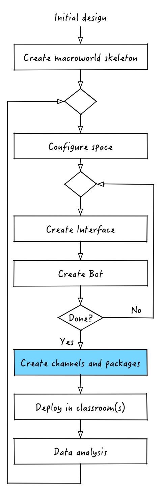
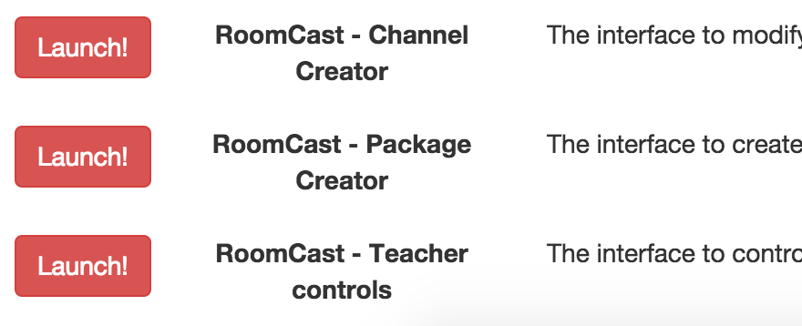
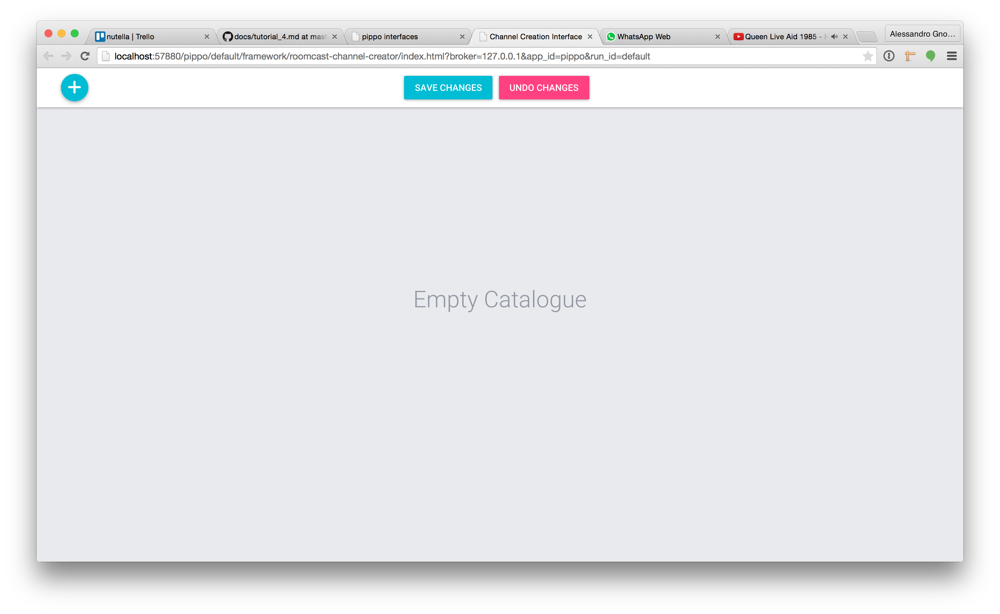

# Create channels and packages

In order to prepare our application to be delivered to students and teachers in the classroom we need to package up our two interfaces so that they can be accessed using RoomCast. In order to do this we are going to use two tools provided by nutella: RoomCast channel creator and package creator.

## Creating channels
Let's start and launch the channel creator. Your screen should look something like this:

As you can see, we have no channels yet. A RoomCast channel represents a single interface or visualization which can be made available to the students. 
The channel creator is the tool which helps developers or teachers create their catalogue of available channels. With this tool channels can be added, deleted or modified. 
Since our catalogue at the beginning is empty, let's add a first channel by clicking on the plus button: a new channel will appear. 
Throughout all Roomcast, a Channel is visually represented by a card: we can start personalizing the channel by clicking on the respective card. 

Let's first start by setting the information on the front of the card: name and description of the channel, icon and background image. When you click on the icon, a color picker will appear: the color associated to the channel icon will be useful to visually distinguish and compare channels in all the RoomCast interfaces. You can also set a background image, typically a screenshot of the channel content, by uploading it from your file system. 

We can now go on setting the actual channel content, by clicking on the 'settings' icon in the top right corner of the card. The card will flip: on the back of the channel we can set the channel type, either web or native iOS channel, and the respective URL or custom URL that represents the actual content visualized inside the channel. 

We have just created our first channel. We can now go on creating two more channels. Once we are done, we can just click on the 'save changes' button to actually update our catalogue on the server.

## Creating channel packages
Once we have created our three channels, we can now decide who can see what: we want to restrict the set of channels available to kids to be played. This parental control feature is provided by Roomcast package creator. 

The package creator interface is divided into three main sections:
<ul>
    <li> *Channels Catalogue*: the catalogue of all the available channels that we have just created from the dedicated interface. The catalogue is updated in real-time when channels are modified from the channel-creation interface.
    </li> 
    <li> *Packages mappings*: the main functionality of the whole package creation. It allows to create, rename and delete packages, i.e. rows of the table. A *RoomCast package* is a container of available channels: the kids from their iPad RoomCast apps will be able to login with a specific package name (which acts as their identity) and see only the list of channels which have been assigned to that package through the package creator interface.
    </li>
    <li> *Activities dropdown*: this all-in-one dropdown menu allows to create, delete or rename activitites for the classroom. A *RoomCast activity* is a set of packages mappings. Different activities will possibly have different packages with their associated channels.  Activities can then be launched from the RoomCast teacher interface.
    </li>
</ul>

[:arrow_backward: PREV](tutorial_7.md) | [NEXT :arrow_forward:](tutorial_9.md)