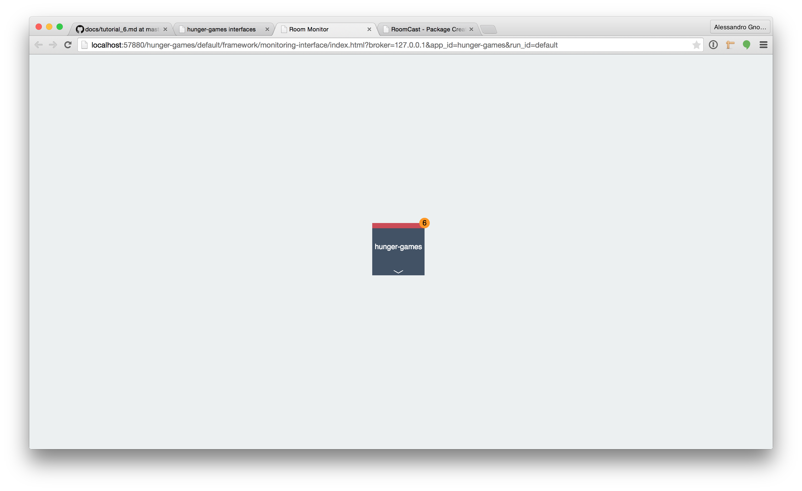
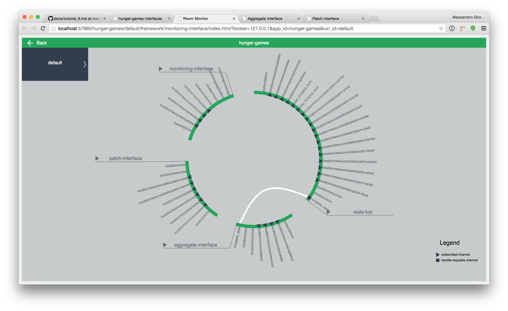

# Deploy in classroom(s)

Our Hunger Games application is finally ready! Yay! In order for students and teacher to use it in the classroom we need to make it accessible to them. This might involve moving it to a server... But we're gonna skip that step. We are also not gonna deal with the RoomCast iPad and OSX native applications capable of broadcasting any channel to any device they are installed in.

What we are going to focus on here are the tools that nutella makes available to developers to monitor and control macroworld applications running in the classroom, that is Room Monitor.

By now you should be comfortable launching things using the main interface provided by nutella. Go right ahead and launch Room monitor. You should see something like this.

However, if you click on the hunger games you should be able to see something much more interesting.

What is that? That is a visualization of all the components in your applications and how they are connected among each other. Green rim, online componenent, red rim, offline component. 

[:arrow_backward: PREV](tutorial_8.md) | [NEXT :arrow_forward:](tutorial_10.md)