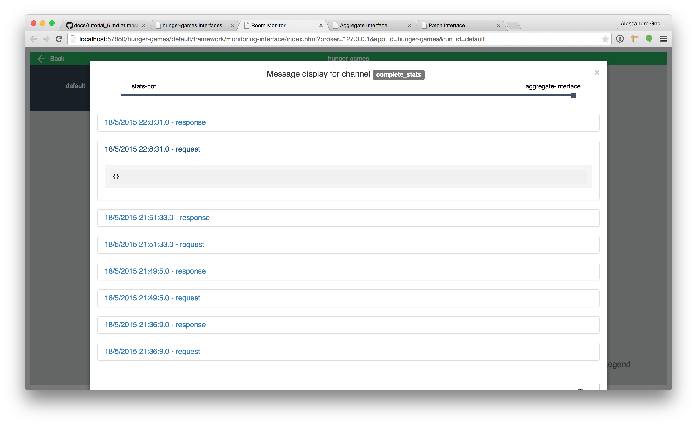
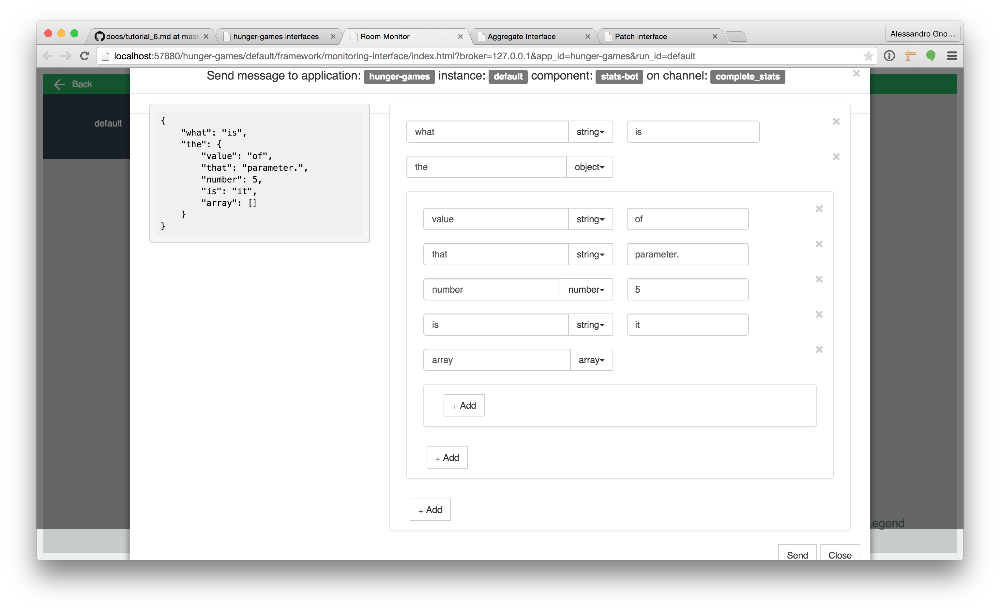
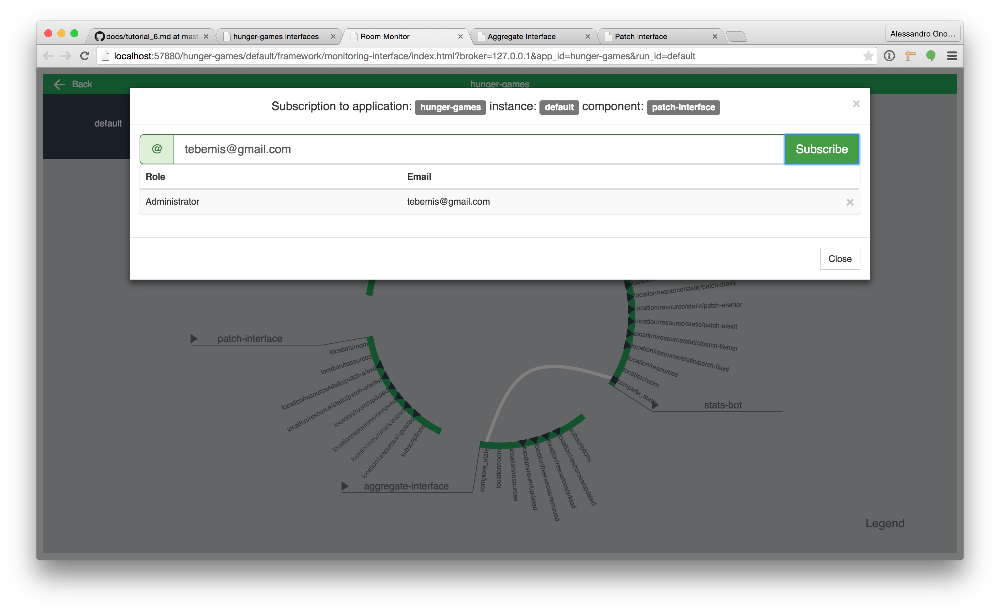
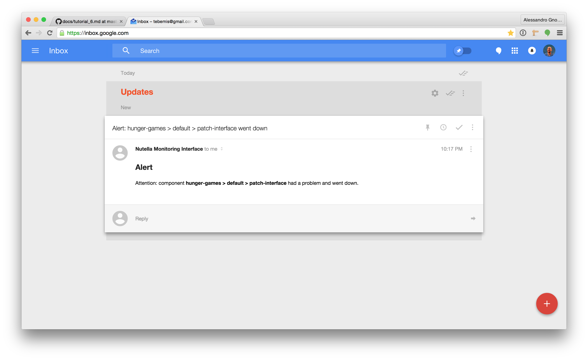

# Deploy in classroom(s)

Our Hunger Games application is finally ready! Yay! In order for students and teacher to use it in the classroom we need to make it accessible to them. This might involve moving it to a server... But we're gonna skip that step. All there is really is to install nutella on your server and clone the repository of your application over. Done.

We are also not gonna deal with the RoomCast iPad and OSX native applications. We don't have them on the AppStore yet and compiling them is too much of a pain in the butt. Just know that they are capable of broadcasting any of the channels and packages we configured in the previous step to any device they are installed on. Teachers can also use the Room Cast teacher controls to switch between different activities and synchronously changing the state of each single component in the application (that is of course subscribed to listed for such events).

What we are going to focus on here are the tools that nutella makes available to developers to monitor and control macroworld applications running in the classroom, that is Room Monitor. By now you should be comfortable launching things using the main interface provided by nutella so go right ahead and launch Room monitor. You should see something like this.

Pretty boring right? However, if you click on the hunger games box you should be able to see something much more interesting.

What is that? That is a visualization of all the components in your applications and how they are connected among each other. Green rim, online componenent, red rim, offline component. White lines are the connections among components, that is channels. Of course you can click on those lines and inspect the last messages exchange over that channel, like so.

You can also "poke" components by sending them messages.

Finally, you can subscribe to components and get notified via email whenever they go offline. No more logging onto the server to check if the app is still going! :smiley:

Fun, isn't it? 

# Next?
Now that we were able to run our application in a "real classroom" we are ready for the last step, which comes after classroom time.

[:arrow_backward: PREV](tutorial_8.md) | [NEXT :arrow_forward:](tutorial_10.md)